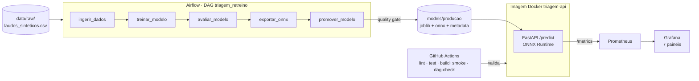

# Triagem Automática de Laudos Médicos

Um hospital de referência recebe centenas de laudos por dia, e um achado crítico (hemorragia,
pneumotórax, infarto) perdido no meio da fila pode custar horas de atraso no atendimento. Este
projeto classifica automaticamente o texto de cada laudo em **normal**, **atenção** ou
**urgente**, e cobre todo o ciclo de vida do modelo em produção: API em Docker, otimização de
latência com ONNX Runtime, retreino orquestrado pelo Airflow, monitoramento com Prometheus +
Grafana e CI no GitHub Actions.

> Tech Challenge — MLOps. Enunciado em [`docs/enunciado_tech_challenge.md`](docs/enunciado_tech_challenge.md).

## Sumário

1. [Arquitetura](#arquitetura)
2. [Decisão de deploy em nuvem](#decisão-de-deploy-em-nuvem)
3. [Dataset](#dataset)
4. [Modelo e resultados](#modelo-e-resultados)
5. [Otimização de latência (ONNX)](#otimização-de-latência-onnx)
6. [Como executar](#como-executar)
7. [Monitoramento](#monitoramento)
8. [Orquestração (Airflow)](#orquestração-airflow)
9. [CI/CD](#cicd)
10. [Estrutura do repositório](#estrutura-do-repositório)
11. [Limitações e próximos passos](#limitações-e-próximos-passos)
12. [Vídeo STAR](#vídeo-star)

## Arquitetura



- **Um único pacote Python** (`src/triagem`) concentra toda a lógica. O CLI de treino, a DAG do
  Airflow e o build Docker chamam as **mesmas funções** (`triagem.pipeline`), então não há duas
  implementações do treino para divergirem.
- A **normalização do texto** (minúsculas, sem acentos) é uma função compartilhada entre treino e
  serving, o que evita *training-serving skew*.
- A imagem Docker é **autocontida**: o estágio `treino` do multi-stage build treina e exporta o
  modelo, e o estágio `runtime` (python:3.12-slim, usuário não-root) leva só o necessário para
  servir.

Detalhes em [`docs/arquitetura.md`](docs/arquitetura.md).

## Decisão de deploy em nuvem

**Padrão escolhido: real-time (API síncrona), com batch só como complemento.**

| Critério | Batch | Real-time (escolhido) | Serverless puro |
|---|---|---|---|
| Latência | minutos a horas | milissegundos | ms, mas com *cold start* |
| Aderência ao caso | laudo urgente esperaria o próximo lote | classifica no momento em que o laudo é emitido | primeira requisição lenta num caso crítico |
| Custo | baixo (recursos efêmeros) | maior (instância sempre ativa) | proporcional ao uso |
| Complexidade | baixa | média (API, escala, monitoramento) | baixa operação, observabilidade limitada |

**Por quê:**
- A triagem existe para **mudar o fluxo imediato** do atendimento: um laudo urgente precisa subir
  na fila assim que é emitido. Batch noturno atrasaria casos críticos em horas.
- O modelo (TF-IDF + Random Forest em ONNX) tem **custo de inferência constante e pequeno** por
  requisição (~0,1 ms), e o artefato (~4,5 MB) cabe folgado em memória. É o perfil ideal para
  uma API de baixa latência.
- Serverless puro foi descartado como padrão principal por causa do **cold start** num caso de uso
  crítico. A solução usa um serviço serverless de containers **com instância mínima sempre ativa**.

**Provedor: Google Cloud (GCP)** — o mesmo container roda sem mudanças no Cloud Run (a API já lê a
porta da variável `PORT`).

| Camada | GCP (escolhido) | AWS | Azure |
|---|---|---|---|
| Registro de imagens | Artifact Registry | ECR | ACR |
| Serving real-time | **Cloud Run** (`min-instances=1`, ingress interno, escala por concorrência) | ECS Fargate / SageMaker Endpoint | Container Apps |
| Modelos e dados | Cloud Storage | S3 | Blob Storage |
| Retreino orquestrado | Cloud Composer (Airflow gerenciado) | MWAA | Data Factory com Airflow |
| Observabilidade | Managed Service for Prometheus + Grafana, Cloud Logging | CloudWatch | Azure Monitor |
| CI/CD sem chaves estáticas | GitHub Actions + Workload Identity Federation (OIDC) | OIDC + IAM Role | OIDC + Managed Identity |

**Fluxo de produção proposto:** push na `main` → CI (lint, testes, build + smoke) → push da imagem
para o Artifact Registry via OIDC → deploy no Cloud Run com rollout gradual. O retreino no
Composer grava a nova versão no Cloud Storage e só promove se passar no quality gate
(champion vs. challenger).

**Segurança (dados de saúde, LGPD):** anonimização dos laudos antes do treino; endpoint com ingress
interno e autenticação IAM; menor privilégio para as service accounts; nada de credenciais no
repositório (OIDC); logs sem o texto do laudo; rate limiting no gateway, contra extração do
modelo.

**FinOps:** uma única instância mínima (vCPU pequena, já que o modelo não precisa de GPU);
escala horizontal por concorrência; labels de custo por ambiente/serviço; retenção curta de logs;
o retreino roda como job efêmero.

**Batch como complemento:** o reprocessamento noturno de laudos antigos (por exemplo, para
auditoria ou após um novo modelo) pode rodar como Cloud Run Job reusando a mesma imagem.

> Nada disso foi provisionado: o enunciado pede a análise textual, e todo o projeto roda localmente.

## Dataset

**Sintético, em português, gerado de forma determinística** por
`python -m triagem.dados` (seed 42) e versionado em `data/raw/laudos_sinteticos.csv`.

- **Por que sintético:** os datasets sugeridos não servem diretamente. O MIMIC-III exige
  credenciamento, e o Medical Abstracts TC Corpus classifica *especialidade*, não *urgência*
  (converter isso em urgência seria inventar rótulos). O gerador entrega exatamente as três classes
  do enunciado, roda offline no CI e no Airflow e é reprodutível byte a byte (há um teste que
  garante isso).
- **Esquema:** `id`, `texto`, `classe` (`normal` | `atencao` | `urgente`). **3.000 laudos** (o
  mínimo exigido é 2.000), desbalanceados de propósito: 45% normal, 35% atenção, 20% urgente.
- **Para não ser trivial:** templates por modalidade (raio-X, TC, US, ECG, RM); vocabulário
  compartilhado entre classes; **negações** que reutilizam termos críticos ("Ausência de sinais de
  hemorragia", "Sem desvio da linha média"), o que obriga o modelo a usar bigramas; 30% dos laudos
  sem a frase de conclusão; e **3% de ruído de rótulo**.
- **Contrato de dados (fail-fast):** antes do treino, `validar_dataset` verifica colunas, nulos,
  textos vazios, classes válidas, ≥ 2.000 linhas, presença das 3 classes e ids únicos.
- **Limitação:** laudos reais são muito mais variados. O sistema foi feito para trocar o CSV por
  dados reais anonimizados sem mudar o código.

## Modelo e resultados

`TfidfVectorizer(ngram_range=(1, 2), min_df=2, max_features=20000)` → `RandomForestClassifier(n_estimators=200, class_weight="balanced")`,
com split estratificado 80/20.

Resultados no conjunto de teste (600 laudos), do `metadata.json` do modelo em produção:

| Métrica | Valor |
|---|---|
| Acurácia | 0,955 |
| F1-macro | 0,948 |
| Recall de **urgente** | 0,871 |

| Real \ Previsto | normal | atencao | urgente |
|---|---|---|---|
| **normal** | 265 | 1 | 0 |
| **atencao** | 6 | 200 | 4 |
| **urgente** | 11 | 5 | 108 |

O recall de urgente é a métrica mais importante (deixar passar um urgente é o erro mais caro), e
o quality gate exige ≥ 0,85. Parte dos erros vem dos 3% de ruído de rótulo inserido de propósito:
laudos com texto de "normal" rotulados como "urgente".

**Duas decisões de modelagem vieram da conversão para ONNX** (ambas cobertas por testes):
- `sublinear_tf=False`: o skl2onnx não reproduz o tf logarítmico. Termos repetidos no laudo
  divergiam até 0,08 na probabilidade. Sem ele, a paridade é exata (diferença máxima de ~8e-7) e o
  F1 não mudou.
- `lowercase=False` no TF-IDF: a caixa já é tratada por `normalizar_texto`. Isso tira do grafo
  ONNX o operador `StringNormalizer`, que exige o locale `en_US.UTF-8` (ausente na imagem slim) e
  quebrava o container.

## Otimização de latência (ONNX)

**Técnica: conversão do pipeline inteiro (TF-IDF + Random Forest) para ONNX e execução com ONNX
Runtime.** A conversão só é aceita se a paridade com o scikit-learn passar: concordância de classe
≥ 99% e diferença de probabilidade ≤ 1e-2. Se falhar, a versão não é promovida.

Benchmark ([`reports/latencia.md`](reports/latencia.md)): 1.000 chamadas com batch 1 após 50 de
warmup, 1 thread por backend, percentis (não média). O benchmark roda **dentro de uma rede Docker**
(Linux) com `bash scripts/benchmark_docker.sh`:

**Em processo (só a predição, incluindo o pré-processamento):**

| Backend | P50 (ms) | P95 (ms) | P99 (ms) | Carga do modelo (ms) | Artefato (KiB) |
|---|---|---|---|---|---|
| scikit-learn (original) | 13,062 | 18,218 | 25,163 | 1020,6 | 7868 |
| **ONNX Runtime (otimizado)** | **0,112** | **0,183** | **0,258** | **107,5** | **4536** |

**Speedup: 117x no P50 e 99x no P95.** O artefato fica 42% menor e carrega 9,5x mais rápido
(bom para o *cold start*).

**Ponta a ponta via HTTP (API em Docker):**

| Backend | P50 (ms) | P95 (ms) | P99 (ms) |
|---|---|---|---|
| scikit-learn | 15,231 | 20,492 | 28,013 |
| **ONNX Runtime** | **2,156** | **2,961** | **3,887** |

**Speedup: 7x no P50 e P95.** No HTTP o ganho é menor porque o overhead fixo da requisição (rede,
parsing JSON, validação, middleware de métricas, ~2 ms) passa a dominar quando a inferência cai
para 0,1 ms — a Lei de Amdahl vista em aula.

> **Nota de medição:** chamadas feitas do Windows para o container (port-forward do Docker Desktop)
> ganham ~40 ms de atraso de TCP em POSTs, que não existe entre serviços na nuvem. Por isso o
> benchmark HTTP e o gerador de carga rodam **dentro** da rede Docker.

## Como executar

**Pré-requisitos:** Docker (com Compose v2) e [uv](https://docs.astral.sh/uv/). O uv instala
sozinho o Python 3.12.

### 1. Ambiente, testes e treino local

```bash
uv sync --all-extras                 # cria .venv com todas as dependências
uv run pytest                        # 74 testes
uv run ruff check . && uv run ruff format --check .
uv run python -m triagem.treinar     # treina, avalia, exporta ONNX e promove em models/producao
```

### 2. API + Prometheus + Grafana

```bash
docker compose up -d --build
```

| Serviço | URL |
|---|---|
| API (Swagger) | http://localhost:8000/docs |
| Prometheus | http://localhost:9090 |
| Grafana (acesso anônimo; admin/admin) | http://localhost:3000 |

Teste rápido:

```bash
curl -X POST localhost:8000/predict -H "Content-Type: application/json" \
     -d '{"texto": "Tomografia de crânio. Hematoma subdural agudo com efeito de massa."}'
# {"classe":"urgente","probabilidades":{...},"versao_modelo":"...","backend":"onnx"}
```

Gerar tráfego para o dashboard (roda dentro da rede do Compose; ~5% de payloads inválidos de propósito):

```bash
docker compose --profile carga run --rm carga        # 120 s a 20 req/s
```

Para comparar backends: `MODEL_BACKEND=sklearn docker compose up -d api`.

### 3. Airflow (retreino)

```bash
docker compose -f docker-compose.airflow.yml up -d --build   # UI em http://localhost:8080
```

A UI abre **sem login**: isso é só para desenvolvimento local, via
`AIRFLOW__CORE__SIMPLE_AUTH_MANAGER_ALL_ADMINS`. Se a porta 8080 estiver ocupada, use
`AIRFLOW_PORT=8081`. **No Linux**, rode antes `echo "AIRFLOW_UID=$(id -u)" > .env` para o
container conseguir gravar em `data/processed/` e `models/` (no Docker Desktop, Windows ou Mac,
isso não é necessário). Ative a DAG `triagem_retreino` e clique em *Trigger*, ou rode uma execução
completa pelo terminal:

```bash
docker compose -f docker-compose.airflow.yml run --rm airflow \
  bash -c "airflow db migrate && airflow dags test triagem_retreino"
```

Para a API servir o modelo promovido pela DAG (em vez do embutido na imagem):

```bash
docker compose -f docker-compose.yml -f docker-compose.modelo-local.yml up -d
```

### 4. Benchmark de latência

```bash
docker build -t triagem-api:local .
bash scripts/benchmark_docker.sh     # gera reports/latencia.md e reports/latencia.json
```

## Monitoramento

A API expõe `/metrics` (instrumentada com `prometheus_client`). O Prometheus coleta a cada 5 s,
e o Grafana é **provisionado como código** (datasource e dashboard em `monitoring/`).

| Métrica | Tipo | Labels |
|---|---|---|
| `triagem_http_requests_total` | Counter | `method`, `rota`, `status` |
| `triagem_http_request_duration_seconds` | Histogram (buckets de 0,1 ms a 2,5 s) | `method`, `rota` |
| `triagem_inferencia_duration_seconds` | Histogram | `backend` |
| `triagem_predicoes_total` | Counter | `classe` |
| `triagem_modelo_info` | Info | `versao`, `backend` |

O label `rota` usa o *template* da rota (rotas desconhecidas viram `desconhecida`), o que evita
explosão de cardinalidade.

**Dashboard "Triagem de Laudos — API" (7 painéis):**

1. Total de requisições em `/predict`
2. Modelo em produção (versão e backend)
3. Requisições por segundo, por status HTTP: `sum by (status) (rate(triagem_http_requests_total{rota="/predict"}[1m]))`
4. Latência HTTP P50/P95/P99: `histogram_quantile(0.95, sum by (le) (rate(triagem_http_request_duration_seconds_bucket{rota="/predict"}[1m])))`
5. Taxa de erro (4xx + 5xx) em %
6. Predições por classe (últimos 5 min)
7. Latência de inferência P95 por backend


## Orquestração (Airflow)

DAG `triagem_retreino` (Airflow 3.3.2, TaskFlow API, `@weekly` e disparo manual):

`ingerir_dados` → `treinar_modelo` → `avaliar_modelo` → `exportar_onnx` → `promover_modelo`

- As tasks são finas: cada uma chama uma função de `triagem.pipeline`, testada sem Airflow.
- Entre as tasks trafegam **só caminhos e métricas** via XCom, nunca os dados.
- `ingerir_dados` valida o contrato de dados (fail-fast).
- `exportar_onnx` bloqueia se a paridade ONNX falhar.
- `promover_modelo` aplica o **quality gate champion vs. challenger**: promove para
  `models/producao` só se F1-macro ≥ 0,80, recall de urgente ≥ 0,85 e F1 ≥ F1 do campeão − 0,01.
  Rejeitar um challenger não falha a DAG, porque é um resultado válido.


## CI/CD

`.github/workflows/ci.yml` roda em push/PR para a `main`, com 4 jobs:

| Job | O que garante |
|---|---|
| `lint` | `ruff check` e `ruff format --check` |
| `test` | 74 testes com `pytest` e cobertura mínima de 80% (atual: ~91%) |
| `build` (depende de lint e test) | a imagem Docker é construída (treinando o modelo) e passa no smoke test: health, predição urgente, 422 para inválido e `/metrics` |
| `dag-check` | a DAG carrega sem erros no Airflow 3.3.2 e tem as 5 tasks esperadas |

Cache de dependências (uv) e de camadas Docker (GitHub Actions cache). O passo seguinte (push para
o Artifact Registry via OIDC e deploy no Cloud Run) está descrito na
[decisão de nuvem](#decisão-de-deploy-em-nuvem).

## Estrutura do repositório

```
.github/workflows/ci.yml      CI: lint, test, build + smoke, dag-check
airflow/                      Dockerfile do Airflow e validação da DAG
dags/triagem_retreino.py      DAG de retreino
data/raw/                     dataset sintético versionado
docs/                         enunciado, arquitetura, roteiro do vídeo, imagens, spec e plano
monitoring/                   Prometheus e Grafana (provisionamento + dashboard)
reports/                      resultados do benchmark de latência
scripts/                      smoke test, gerador de carga, benchmark em Docker
src/triagem/                  pacote: dados, modelo, ONNX, artefatos, pipeline, API, benchmark
tests/                        74 testes (pytest)
Dockerfile                    imagem multi-stage da API
docker-compose.yml            API + Prometheus + Grafana (+ gerador de carga opcional)
docker-compose.airflow.yml    Airflow standalone
```

## Limitações e próximos passos

- **Dados reais:** trocar o dataset sintético por laudos reais anonimizados (o contrato de dados já
  valida o formato).
- **Drift:** monitorar a distribuição das predições e do texto (PSI, teste KS, Evidently) e disparar
  o retreino por evento, e não só por agenda.
- **Deploy contínuo:** push para o Artifact Registry via OIDC, deploy canary/shadow no Cloud Run e
  rollback automático por SLO.
- **Registro de modelos:** MLflow Model Registry no lugar do diretório `models/producao`.
- **Alertas:** regras no Grafana (por exemplo, taxa de erro > 5% por 3 min, P95 > 50 ms).
- **Modelos de linguagem:** um transformer compacto (DistilBERT em português) quantizado em INT8
  pode melhorar a generalização em laudos reais, ao custo de mais latência.

## Vídeo STAR

Roteiro em [`docs/roteiro_video_star.md`](docs/roteiro_video_star.md).

Link do vídeo: (a ser adicionado após a gravação)
