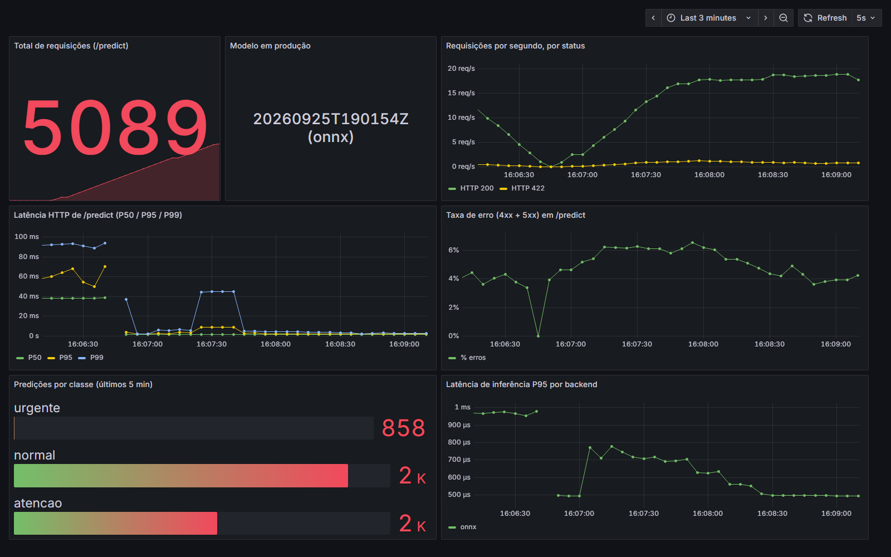
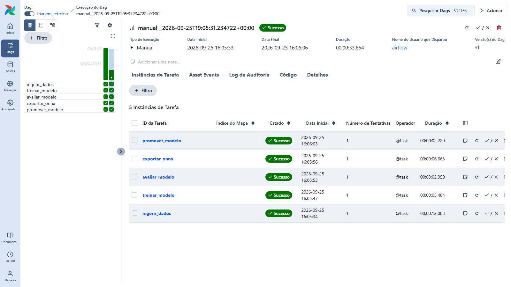

# 🩺 Triagem Automática de Laudos Médicos

> Classificação de laudos médicos em texto por **urgência** (normal · atenção · urgente), servida em
> tempo real por uma API FastAPI em Docker, com modelo otimizado em **ONNX Runtime** (117x mais
> rápido que o original), retreino orquestrado por **Airflow**, observabilidade com
> **Prometheus + Grafana** e CI no **GitHub Actions**. Projeto do Tech Challenge de MLOps.

[](https://github.com/Henry3151/triagem-laudos-mlops/actions/workflows/ci.yml)


---

## 👤 Autor

**Henrique Silva** — Data Scientist | ML Engineer

[](https://www.linkedin.com/in/henrique-silva-ds)
[](https://github.com/Henry3151)

Pós-graduação em Machine Learning Engineering — FIAP + Alura (PosTech)

---

## 🎬 Vídeo STAR

> **Link do vídeo:** `[ADICIONAR LINK DO VÍDEO AQUI]`
>
> Roteiro (5 min, método STAR): [`docs/roteiro_video_star.md`](docs/roteiro_video_star.md)

---

## 📌 Sumário

| | |
|---|---|
| [Visão geral](#-visão-geral) | [Monitoramento](#-monitoramento-prometheus--grafana) |
| [O problema](#-o-problema) | [Orquestração](#%EF%B8%8F-orquestração-airflow) |
| [Arquitetura](#%EF%B8%8F-arquitetura) | [CI/CD](#-cicd-github-actions) |
| [Decisão de nuvem](#%EF%B8%8F-decisão-de-deploy-em-nuvem) | [Como executar](#-como-executar) |
| [Dataset](#-dataset) | [Histórico de commits](#-histórico-de-commits) |
| [Modelo e resultados](#-modelo-e-resultados) | [Limitações](#%EF%B8%8F-limitações-conhecidas-e-próximos-passos) |
| [Otimização de latência](#-otimização-de-latência-onnx-runtime) | [Stack](#-stack-tecnológico) |

---

## 🔭 Visão geral

O foco não está só no classificador, mas no **ciclo de vida do modelo em produção**: servir com
baixa latência, retreinar com segurança, observar o comportamento e validar cada mudança
automaticamente.

| Dimensão | Ferramenta | O que garante | Evidência no repositório |
|---|---|---|---|
| Serving | FastAPI + Docker multi-stage | API REST autocontida, usuário não-root, healthcheck | `Dockerfile`, `src/triagem/api/` |
| Otimização | ONNX Runtime | 117x menos latência em processo, com paridade exata | `reports/latencia.md` |
| Orquestração | Airflow 3.3.2 (TaskFlow) | Retreino com quality gate champion vs. challenger | `dags/triagem_retreino.py` |
| Observabilidade | Prometheus + Grafana | 5 métricas e 7 painéis provisionados como código | `monitoring/`, `docs/img/dashboard.png` |
| Qualidade | ruff + pytest | 74 testes, 96% de cobertura | `tests/` |
| Automação | GitHub Actions | lint → test → build + smoke test · validação da DAG | `.github/workflows/ci.yml` |
| Reprodutibilidade | uv + `uv.lock` + seeds fixas | Mesmas versões em dev, CI, API e Airflow (Python 3.12) | `pyproject.toml`, `uv.lock` |

---

## 🚑 O problema

Um hospital de referência recebe centenas de laudos por dia. Um achado crítico perdido no meio da
fila (hemorragia intracraniana, pneumotórax hipertensivo, supradesnivelamento de ST) pode custar
horas de atraso no atendimento. O sistema lê o texto do laudo no momento em que ele é emitido e
devolve a classe de urgência, para a fila ser priorizada.

| Desafio | Solução adotada |
|---|---|
| Laudo urgente não pode esperar um lote noturno | Serving **real-time** por API síncrona |
| Deixar passar um urgente é o erro mais caro | **Recall de urgente** como métrica de gate (≥ 0,85) |
| Negações enganam modelos ingênuos ("*sem* sinais de hemorragia") | TF-IDF com **bigramas** (`ngram_range=(1, 2)`) |
| Texto livre com acentos, caixa e espaços variados | Normalização **compartilhada** entre treino e serving (sem *training-serving skew*) |
| Otimizar sem mudar as predições | Conversão ONNX com **teste de paridade bloqueante** |
| Retreinar sem piorar a produção | **Quality gate** champion vs. challenger na DAG |
| "Funciona na minha máquina" | Docker multi-stage + `uv.lock` + Python 3.12 em todo lugar |

---

## 🏗️ Arquitetura

```
                        ┌──────────────────────────────────────────────────────────┐
                        │              GitHub Actions  (push / PR → main)          │
                        │   lint (ruff) ─┐                                         │
                        │   test (pytest)┴─► build + smoke test      dag-check     │
                        └──────────────────────────┬────────────────────┬──────────┘
                                                   │ valida             │ valida
                                                   ▼                    ▼
┌─────────────────────┐    ┌─────────────────────────────────────────────────────────┐
│ data/raw/           │    │  Airflow 3.3.2 · DAG triagem_retreino (@weekly)         │
│ laudos_sinteticos   ├───►│  ingerir ─► treinar ─► avaliar ─► exportar ─► promover  │
│ .csv (3.000 laudos) │    │  _dados     _modelo    _modelo    _onnx       _modelo   │
└─────────────────────┘    └──────────────────────────────────────────────┬──────────┘
                                                            quality gate  │
                                                                          ▼
                                          ┌──────────────────────────────────────────┐
                                          │ models/producao/                         │
                                          │ modelo.onnx · modelo.joblib · metadata   │
                                          └────────────────────┬─────────────────────┘
                                                               │
          ┌────────────────────────────────────────────────────┼─────────────────────┐
          │  docker compose                                    ▼                     │
          │   ┌───────────────┐  POST /predict   ┌──────────────────────────┐        │
          │   │ carga         ├─────────────────►│ api :8000                │        │
          │   │ (opcional)    │                  │ FastAPI + ONNX Runtime   │        │
          │   └───────────────┘                  └────────────┬─────────────┘        │
          │                                                   │ GET /metrics (5 s)   │
          │   ┌───────────────┐    PromQL        ┌────────────┴─────────────┐        │
          │   │ grafana :3000 ├─────────────────►│ prometheus :9090         │        │
          │   │ 7 painéis     │                  │ TSDB (pull-based)        │        │
          │   └───────────────┘                  └──────────────────────────┘        │
          └──────────────────────────────────────────────────────────────────────────┘
```

**Princípio central:** um único pacote Python (`src/triagem`) concentra toda a lógica. O CLI de
treino, a DAG do Airflow e o build Docker chamam as **mesmas funções** de `triagem.pipeline`, então
não existem duas implementações do treino que possam divergir.

### Fluxo de uma requisição

```
POST /predict {"texto": "..."}
      │
      ▼
[ Pydantic ]        strip · 1 a 5.000 caracteres · tipo string ──── inválido ──► 422
      │
      ▼
[ normalizar_texto ] minúsculas · sem acentos · espaços colapsados   (mesma função do treino)
      │
      ▼
[ ONNX Runtime ]    TF-IDF (1-2 gramas) → Random Forest (200 árvores), 1 thread · ~0,1 ms
      │                                                    exceção ──► 500 genérico + log
      ▼
[ métricas ]        contador por classe · histograma de inferência · contador/histograma HTTP
      │
      ▼
{"classe": "urgente", "probabilidades": {...}, "versao_modelo": "...", "backend": "onnx"}
```

### Estrutura do código

```
triagem-laudos-mlops/
├── src/triagem/
│   ├── preprocessamento.py   # normalizar_texto — compartilhada treino/serving
│   ├── dados.py              # gerador sintético · contrato de dados · split estratificado
│   ├── modelo.py             # pipeline TF-IDF + Random Forest · métricas
│   ├── onnx_export.py        # conversão skl2onnx + verificação de paridade (treino)
│   ├── onnx_runtime.py       # sessão ONNX Runtime (serving, sem deps de treino)
│   ├── classificadores.py    # backends sklearn / onnx atrás da mesma interface
│   ├── artefatos.py          # versionamento · metadata · quality gate de promoção
│   ├── pipeline.py           # etapas usadas pela DAG e pelo CLI
│   ├── treinar.py            # CLI: python -m triagem.treinar
│   ├── benchmark.py          # CLI: python -m triagem.benchmark (P50/P95/P99)
│   └── api/                  # app FastAPI · schemas · métricas Prometheus
├── dags/triagem_retreino.py  # DAG do Airflow (tasks finas → triagem.pipeline)
├── airflow/                  # Dockerfile do Airflow + check_dag.py (usado no CI)
├── monitoring/               # prometheus.yml · datasource e dashboard do Grafana
├── scripts/                  # smoke_test.sh · gerar_carga.py · benchmark_docker.sh
├── reports/                  # latencia.md / latencia.json (benchmark real)
├── data/raw/                 # dataset sintético versionado
├── tests/                    # 74 testes (pytest)
├── docs/                     # arquitetura · roteiro do vídeo · prints · spec e plano
├── Dockerfile                # multi-stage: treino → deps → runtime (675 MB)
├── docker-compose.yml        # api + prometheus + grafana (+ carga opcional)
└── docker-compose.airflow.yml
```

Mais detalhes em [`docs/arquitetura.md`](docs/arquitetura.md).

---

## ☁️ Decisão de deploy em nuvem

**Escolha: real-time (API síncrona) na GCP, com Cloud Run e instância mínima sempre ativa.** Batch
fica só como complemento.

| Critério | Batch | **Real-time (escolhido)** | Serverless puro |
|---|---|---|---|
| Latência | minutos a horas | **milissegundos** | ms, mas com *cold start* |
| Aderência clínica | urgente espera o próximo lote | **classifica quando o laudo é emitido** | 1ª requisição lenta num caso crítico |
| Custo | baixo (recursos efêmeros) | maior (instância sempre ativa) | proporcional ao uso |
| Complexidade | baixa | média (API, escala, monitoramento) | baixa operação, pouca observabilidade |

**Por quê:**

- A triagem existe para **mudar o fluxo imediato** do atendimento. Um batch noturno atrasaria os
  casos críticos em horas.
- O modelo tem **custo de inferência constante e pequeno** (~0,1 ms em ONNX) e o artefato tem só
  ~4,5 MB. É o perfil de uma API de baixa latência (modelo "leve", na taxonomia da aula de
  comportamento computacional).
- Serverless puro foi descartado por causa do **cold start** num caso crítico. O Cloud Run com
  `min-instances=1` mantém a elasticidade sem esse risco. A API já lê a porta da variável `PORT`,
  então o mesmo container roda lá sem mudanças.

| Camada | **GCP (escolhido)** | AWS | Azure |
|---|---|---|---|
| Registro de imagens | Artifact Registry | ECR | ACR |
| Serving real-time | **Cloud Run** (`min-instances=1`, ingress interno) | ECS Fargate / SageMaker Endpoint | Container Apps |
| Modelos e dados | Cloud Storage | S3 | Blob Storage |
| Retreino | Cloud Composer (Airflow gerenciado) | MWAA | Data Factory + Airflow |
| Observabilidade | Managed Service for Prometheus + Grafana | CloudWatch | Azure Monitor |
| CI/CD sem chaves | GitHub Actions + Workload Identity Federation (OIDC) | OIDC + IAM Role | OIDC + Managed Identity |

```
 push main ─► CI (lint · test · build + smoke) ─► Artifact Registry (OIDC) ─► Cloud Run (rollout gradual)
                                                                                   ▲
 Cloud Composer: DAG de retreino ─► Cloud Storage (nova versão) ─► quality gate ───┘
```

- **Segurança (dados de saúde, LGPD):** anonimização antes do treino; ingress interno com
  autenticação IAM; menor privilégio para as service accounts; nenhuma credencial no repositório
  (OIDC); logs sem o texto do laudo; rate limiting no gateway, contra extração do modelo.
- **FinOps:** uma instância mínima com vCPU pequena (sem GPU); escala por concorrência; labels de
  custo por ambiente; retenção curta de logs; retreino como job efêmero.
- **Batch como complemento:** reprocessamento de laudos antigos como Cloud Run Job, com a mesma
  imagem.

> Nada foi provisionado: o enunciado pede a análise arquitetural textual, e todo o projeto roda
> localmente.

---

## 📊 Dataset

**Sintético, em português e determinístico**: `python -m triagem.dados` (seed 42), versionado em
`data/raw/laudos_sinteticos.csv`.

| Característica | Valor |
|---|---|
| Laudos | **3.000** (o mínimo exigido é 2.000) |
| Classes | `normal` 45% · `atencao` 35% · `urgente` 20% (desbalanceado de propósito) |
| Modalidades | radiografia, tomografia, ultrassonografia, ECG, ressonância, angiotomografia |
| Dificuldade proposital | negações que reutilizam termos críticos · 30% sem frase de conclusão · **3% de ruído de rótulo** |
| Reprodutibilidade | um teste garante que o CSV versionado é idêntico ao gerador |
| Contrato de dados | colunas, nulos, textos vazios, classes válidas, ≥ 2.000 linhas, 3 classes, ids únicos |

**Por que sintético:** o MIMIC-III exige credenciamento, e o Medical Abstracts TC Corpus classifica
*especialidade*, não *urgência* (converter isso em urgência seria inventar rótulos). O gerador
entrega exatamente as três classes do enunciado e roda offline no CI e no Airflow.

---

## 🧠 Modelo e resultados

```
texto ─► normalizar_texto ─► TfidfVectorizer(ngram_range=(1, 2), min_df=2, max_features=20000)
                                        │
                                        ▼
                  RandomForestClassifier(n_estimators=200, class_weight="balanced", random_state=42)
```

Resultados no conjunto de teste (600 laudos, split estratificado 80/20), do `metadata.json` do
modelo em produção:

| Métrica | Valor | Limiar do quality gate |
|---|---|---|
| Acurácia | **0,955** | — |
| F1-macro | **0,948** | ≥ 0,80 e ≥ F1 do campeão − 0,01 |
| Recall de **urgente** | **0,871** | ≥ 0,85 |
| Paridade ONNX (concordância de classe) | **100%** | ≥ 99% |
| Paridade ONNX (diferença máx. de probabilidade) | **~7,7e-7** | ≤ 1e-2 |

**Matriz de confusão:**

| Real ↓ \ Previsto → | normal | atencao | urgente |
|---|---|---|---|
| **normal** | **265** | 1 | 0 |
| **atencao** | 6 | **200** | 4 |
| **urgente** | 11 | 5 | **108** |

> O recall de urgente é a métrica que mais importa (deixar passar um urgente é o erro mais caro).
> Parte dos erros vem dos **3% de ruído de rótulo** inserido de propósito no dataset.

**Duas decisões de modelagem vieram da conversão para ONNX** (ambas cobertas por testes):

| Decisão | Motivo | Evidência |
|---|---|---|
| `sublinear_tf=False` | o skl2onnx não reproduz o tf logarítmico: termos repetidos divergiam até **0,08** na probabilidade | paridade passou a ~7,7e-7; F1 0,948 |
| `lowercase=False` no TF-IDF | tira do grafo o `StringNormalizer`, que exige o locale `en_US.UTF-8` (ausente na imagem slim e quebrava o container); a caixa já é tratada por `normalizar_texto` | `test_grafo_sem_string_normalizer` |

---

## ⚡ Otimização de latência (ONNX Runtime)

**Técnica:** conversão do pipeline inteiro (TF-IDF + Random Forest) em um único grafo ONNX,
executado com ONNX Runtime. A exportação **só é aceita se a paridade passar**; caso contrário, a
versão não é promovida.

Metodologia ([`reports/latencia.md`](reports/latencia.md)): 1.000 chamadas com batch 1, após 50 de
warmup, 1 thread por backend, reportando **percentis** (não só a média). Executado **dentro de uma
rede Docker** (Linux, 8 CPUs) com `bash scripts/benchmark_docker.sh`.

### Em processo (só a predição, incluindo o pré-processamento)

| Backend | P50 (ms) | P95 (ms) | P99 (ms) | Média (ms) | Carga do modelo (ms) | Artefato (KiB) |
|---|---|---|---|---|---|---|
| scikit-learn (original) | 13,062 | 18,218 | 25,163 | 13,869 | 1020,6 | 7868 |
| **ONNX Runtime (otimizado)** | **0,112** | **0,183** | **0,258** | **0,122** | **107,5** | **4536** |
| **Ganho** | **117x** | **99x** | **98x** | **114x** | **9,5x** | **−42%** |

### Ponta a ponta via HTTP (API em Docker)

| Backend | P50 (ms) | P95 (ms) | P99 (ms) | Média (ms) |
|---|---|---|---|---|
| scikit-learn | 15,231 | 20,492 | 28,013 | 16,076 |
| **ONNX Runtime** | **2,156** | **2,961** | **3,887** | **2,249** |
| **Ganho** | **7,1x** | **6,9x** | **7,2x** | **7,1x** |

```
Por que o ganho HTTP (7x) é menor que o em processo (117x)?  →  Lei de Amdahl

  sklearn  HTTP ≈ 15,2 ms = ~13,1 ms de inferência + ~2 ms de overhead fixo
  ONNX     HTTP ≈  2,2 ms = ~0,1 ms de inferência + ~2 ms de overhead fixo (rede, JSON, validação, métricas)

  Com a inferência otimizada, o overhead fixo da requisição passa a dominar a latência.
```

> **Nota de medição:** chamadas feitas do Windows para o container (port-forward do Docker Desktop)
> ganham ~40 ms de atraso de TCP em POSTs, que não existe entre serviços na nuvem (medido: ~2 ms
> dentro do container contra ~48 ms a partir do host). Por isso o benchmark HTTP e o gerador de
> carga rodam **dentro** da rede Docker. O efeito aparece no início do print do dashboard abaixo.

---

## 📈 Monitoramento (Prometheus + Grafana)

A API expõe `/metrics` (via `prometheus_client`). O Prometheus coleta a cada **5 s**, e o
Grafana é **provisionado como código** (datasource e dashboard em `monitoring/`, sem configuração
manual).

| Métrica | Tipo | Labels | Uso |
|---|---|---|---|
| `triagem_http_requests_total` | Counter | `method`, `rota`, `status` | RPS e taxa de erro |
| `triagem_http_request_duration_seconds` | Histogram (0,1 ms → 2,5 s) | `method`, `rota` | P50/P95/P99 HTTP |
| `triagem_inferencia_duration_seconds` | Histogram | `backend` | latência só do modelo |
| `triagem_predicoes_total` | Counter | `classe` | distribuição das predições |
| `triagem_modelo_info` | Info | `versao`, `backend` | rastreabilidade do modelo servido |

O label `rota` usa o *template* da rota (rotas inexistentes viram `desconhecida`), o que evita
explosão de cardinalidade. Buckets abaixo de 1 ms existem porque a inferência ONNX leva ~0,1 ms.

### Dashboard "Triagem de Laudos — API" — 7 painéis

| # | Painel | Consulta principal (PromQL) |
|---|---|---|
| 1 | Total de requisições (`/predict`) | `sum(triagem_http_requests_total{rota="/predict"})` |
| 2 | Modelo em produção | `triagem_modelo_info` |
| 3 | Requisições por segundo, por status | `sum by (status) (rate(triagem_http_requests_total{rota="/predict"}[1m]))` |
| 4 | Latência HTTP P50 / P95 / P99 | `histogram_quantile(0.95, sum by (le) (rate(triagem_http_request_duration_seconds_bucket{rota="/predict"}[1m])))` |
| 5 | Taxa de erro (4xx + 5xx) | `100 * sum(rate(...{status=~"4..\|5.."}[1m])) / sum(rate(...[1m]))` |
| 6 | Predições por classe (5 min) | `sum by (classe) (increase(triagem_predicoes_total[5m]))` |
| 7 | Latência de inferência P95 por backend | `histogram_quantile(0.95, sum by (le, backend) (rate(triagem_inferencia_duration_seconds_bucket[1m])))` |



> Carga gerada a 20 req/s com ~5% de payloads inválidos de propósito (painel de erro). À esquerda,
> tráfego vindo do host Windows (~40–90 ms, efeito do port-forward); à direita, tráfego dentro da
> rede do Compose (poucos ms).

---

## ⚙️ Orquestração (Airflow)

DAG `triagem_retreino` (Airflow **3.3.2**, TaskFlow API, `schedule="@weekly"`, também disparável
manualmente):

```
┌──────────────┐   ┌───────────────┐   ┌───────────────┐   ┌──────────────┐   ┌─────────────────┐
│ ingerir_dados├──►│ treinar_modelo├──►│ avaliar_modelo├──►│ exportar_onnx├──►│ promover_modelo │
└──────┬───────┘   └───────┬───────┘   └───────┬───────┘   └──────┬───────┘   └────────┬────────┘
       │                   │                   │                  │                    │
  contrato de dados   models/<versao>/   acurácia · F1 ·     paridade ONNX       champion vs.
  (fail-fast) +       modelo.joblib      recall urgente ·    bloqueante +        challenger →
  split 80/20                            matriz confusão     metadata.json       models/producao
```

| Task | XCom de saída (só ponteiros e métricas, nunca os dados) |
|---|---|
| `ingerir_dados` | caminhos de treino/teste + sha256 do CSV |
| `treinar_modelo` | diretório da versão |
| `avaliar_modelo` | métricas |
| `exportar_onnx` | versão + paridade |
| `promover_modelo` | decisão (`promovido`) e motivo |

- **Quality gate:** promove só se F1-macro ≥ 0,80, recall de urgente ≥ 0,85 e F1 ≥ F1 do campeão
  − 0,01. Rejeitar um challenger **não falha a DAG**, porque é um resultado válido.
- **Tasks finas:** cada uma chama uma função de `triagem.pipeline`, testada sem Airflow.
- **Execução comprovada:** `airflow dags test` concluiu as 5 tasks em ~19 s. Na UI, a execução
  manual abaixo levou ~34 s.



---

## 🔁 CI/CD (GitHub Actions)

```
push / PR → main
   │
   ├──► lint       ruff check · ruff format --check ─┐
   │                                                 ├──► build   docker build (treina o modelo no estágio `treino`)
   ├──► test       74 testes · cobertura ≥ 80% ──────┘            smoke test: /health · urgente · 422 · /metrics
   │
   └──► dag-check  imagem Airflow 3.3.2 · DagBag sem erros · 5 tasks esperadas
```

| Job | O que garante |
|---|---|
| `lint` | estilo e erros estáticos (ruff) |
| `test` | 74 testes com pytest (cobertura atual **96%**, mínimo exigido 80%) |
| `build` | a imagem é construída do zero e responde corretamente: health, predição `urgente`, 422 para inválido, métricas expostas |
| `dag-check` | a DAG carrega num Airflow real, sem erros de importação |

Cache de dependências (uv) e de camadas Docker (cache do GitHub Actions). O passo seguinte (push
para o Artifact Registry via OIDC e deploy no Cloud Run) está descrito na
[decisão de nuvem](#%EF%B8%8F-decisão-de-deploy-em-nuvem).

---

## 🚀 Como executar

### Pré-requisitos

| Ferramenta | Uso |
|---|---|
| [Docker](https://docs.docker.com/get-docker/) + Compose v2 | API, Prometheus, Grafana, Airflow |
| [uv](https://docs.astral.sh/uv/) | ambiente Python (instala o Python 3.12 sozinho) |

| Sistema | Suporte | Observação |
|---|---|---|
| Windows | Sim | desenvolvido e testado aqui (Docker Desktop) |
| Linux | Sim | CI roda em `ubuntu-latest`; para o Airflow, `echo "AIRFLOW_UID=$(id -u)" > .env` |
| macOS | Sim | via Docker Desktop |

### 1. Ambiente, testes e treino local

```bash
uv sync --all-extras                  # cria .venv com as versões exatas do uv.lock
uv run pytest                         # 74 testes
uv run ruff check . && uv run ruff format --check .
uv run python -m triagem.treinar      # treina, avalia, exporta ONNX e promove em models/producao
```

### 2. API + Prometheus + Grafana

```bash
docker compose up -d --build
```

| Serviço | URL |
|---|---|
| API (Swagger) | http://localhost:8000/docs |
| Prometheus | http://localhost:9090 |
| Grafana (acesso anônimo; admin/admin) | http://localhost:3000 |

```bash
curl -X POST localhost:8000/predict -H "Content-Type: application/json" \
     -d '{"texto": "Tomografia de crânio. Hematoma subdural agudo com efeito de massa."}'
# {"classe":"urgente","probabilidades":{...},"versao_modelo":"...","backend":"onnx"}
```

### 3. Gerar tráfego para o dashboard

```bash
docker compose --profile carga run --rm carga    # 120 s a 20 req/s, ~5% inválidos
```

Para comparar backends ao vivo: `MODEL_BACKEND=sklearn docker compose up -d api`.

### 4. Airflow (retreino)

```bash
docker compose -f docker-compose.airflow.yml up -d --build   # UI em http://localhost:8080
```

A UI abre **sem login**, só para desenvolvimento local (`AIRFLOW__CORE__SIMPLE_AUTH_MANAGER_ALL_ADMINS`).
Se a porta 8080 estiver ocupada, use `AIRFLOW_PORT=8081`. Para uma execução completa pelo terminal:

```bash
docker compose -f docker-compose.airflow.yml run --rm airflow \
  bash -c "airflow db migrate && airflow dags test triagem_retreino"
```

Para a API servir o modelo promovido pela DAG (em vez do embutido na imagem):

```bash
docker compose -f docker-compose.yml -f docker-compose.modelo-local.yml up -d
```

### 5. Benchmark de latência

```bash
docker build -t triagem-api:local .
bash scripts/benchmark_docker.sh      # gera reports/latencia.md e reports/latencia.json
```

### 6. Smoke test da imagem

```bash
bash scripts/smoke_test.sh triagem-api:local 8000
```

---

## 🧾 Histórico de commits

Conventional Commits em toda a evolução do projeto: **9** `feat` · **4** `docs` · **2** `build` ·
**1** `ci` · **1** `fix` (até a reescrita deste README).

| # | Commit | Tipo | Mensagem |
|---|---|---|---|
| 1 | `d17e522` | docs | spec de design da triagem de laudos |
| 2 | `070e7c7` | docs | plano de implementação da triagem de laudos |
| 3 | `46b0faf` | build | scaffold do projeto com uv e normalização de texto |
| 4 | `ce4e479` | feat | dataset sintético de laudos com contrato de dados |
| 5 | `3e5262c` | feat | classificador TF-IDF + Random Forest com métricas de avaliação |
| 6 | `6cced7b` | feat | exportação ONNX com verificação de paridade |
| 7 | `c15650b` | feat | versionamento de artefatos e quality gate de promoção |
| 8 | `6e6f770` | feat | backends de inferência sklearn e ONNX Runtime |
| 9 | `8adf863` | feat | etapas do pipeline de treino e CLI |
| 10 | `959eb6b` | feat | API FastAPI de triagem instrumentada com Prometheus |
| 11 | `77ed7c1` | feat | benchmark de latência sklearn vs ONNX Runtime |
| 12 | `defb28d` | fix | remove StringNormalizer do grafo ONNX (lowercase=False) |
| 13 | `0600bf7` | build | imagem Docker multi-stage e stack Prometheus + Grafana |
| 14 | `99d57a4` | feat | DAG Airflow de retreino com quality gate de promoção |
| 15 | `7e521b0` | ci | workflow com lint, testes, build + smoke test e validação da DAG |
| 16 | `3d60e89` | docs | README com arquitetura em nuvem, execução, resultados e roteiro do vídeo |
| 17 | `e03dfee` | docs | instrução de AIRFLOW_UID para hosts Linux |

O projeto seguiu **spec → plano → TDD**: a spec de design e o plano de implementação estão em
[`docs/superpowers/`](docs/superpowers/), e cada funcionalidade entrou com o teste escrito antes.

---

## ⚠️ Limitações conhecidas e próximos passos

| Limitação | Impacto | Próximo passo |
|---|---|---|
| **Dataset sintético** | laudos reais são muito mais variados; o gerador também combina modalidade e achado livremente (ex.: achado de ECG num laudo de ressonância) | trocar por laudos reais anonimizados (o contrato de dados já valida o formato) |
| **Promoção não atômica** | `promover()` apaga `models/producao` e só então renomeia a nova versão; um crash nesse instante deixa a produção sem modelo | troca atômica via symlink/ponteiro, ou um Model Registry (MLflow) |
| Sem detecção de drift | a degradação silenciosa do modelo não é percebida | PSI / teste KS sobre as predições (Evidently) disparando o retreino por evento |
| Sem deploy contínuo real | o CI termina na imagem validada | push para o Artifact Registry via OIDC e rollout canary no Cloud Run |
| Sem alertas | o dashboard exige observação ativa | regras no Grafana (taxa de erro > 5% por 3 min, P95 > 50 ms) |
| Sem autenticação na API | aceitável só em ambiente local | IAM / API gateway com rate limiting |

---

## 🧰 Stack tecnológico

| Categoria | Tecnologias |
|---|---|
| ML | scikit-learn 1.9.1 (TF-IDF + Random Forest), pandas |
| Otimização | skl2onnx 1.20, ONNX Runtime 1.30 |
| Serving | FastAPI 0.141, Uvicorn, Pydantic 2 |
| Orquestração | Apache Airflow 3.3.2 (TaskFlow API) |
| Observabilidade | prometheus-client, Prometheus v3.5, Grafana 12.1 |
| Infra | Docker multi-stage (python:3.12-slim, não-root), Docker Compose |
| CI/CD | GitHub Actions (4 jobs, cache uv + Docker) |
| Qualidade | ruff (lint + format), pytest + pytest-cov |
| Ambiente | uv 0.11, `pyproject.toml`, `uv.lock`, Python 3.12 |

---

## 📬 Contato

**Henrique Silva**

[](https://www.linkedin.com/in/henrique-silva-ds)
[](https://github.com/Henry3151)

---

## 📚 Referências

- Enunciado oficial: [`docs/enunciado_tech_challenge.md`](docs/enunciado_tech_challenge.md)
- Sculley, D. et al. (2015). *Hidden Technical Debt in Machine Learning Systems*. NeurIPS.
- ONNX Runtime: https://onnxruntime.ai · skl2onnx: https://onnx.ai/sklearn-onnx/
- Prometheus — *Histograms and summaries*: https://prometheus.io/docs/practices/histograms/
- Apache Airflow — TaskFlow API: https://airflow.apache.org/docs/
