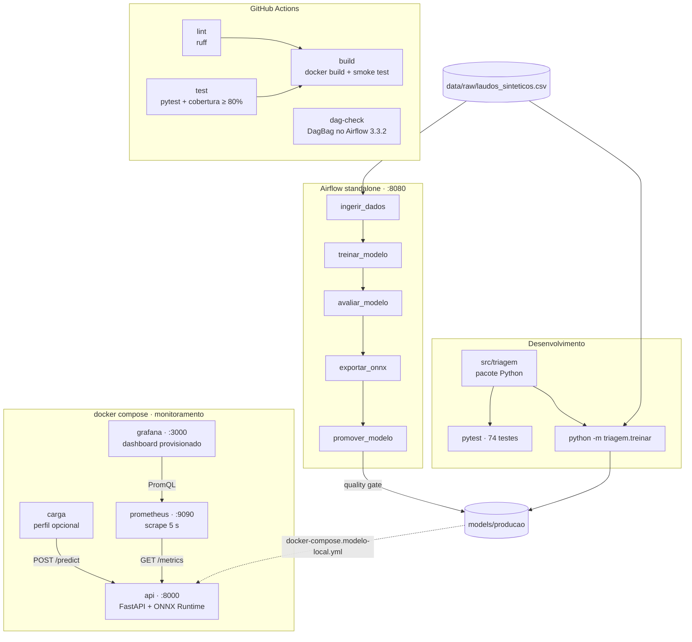

# Arquitetura

## Componentes e portas

## Fluxo de uma requisição

1. `POST /predict` com `{"texto": "..."}`.
2. **Validação (Pydantic):** faz o strip, exige de 1 a 5.000 caracteres e tipo string. Violação
   retorna **422**.
3. **Normalização** (`normalizar_texto`): minúsculas, sem acentos, espaços colapsados. É a mesma
   função do treino.
4. **Inferência ONNX Runtime** (TF-IDF → Random Forest num único grafo, 1 thread): ~0,1 ms.
5. **Métricas:** o histograma de inferência por backend, o contador por classe e (no middleware) o
   contador e o histograma HTTP por rota e status.
6. Resposta: `{"classe", "probabilidades", "versao_modelo", "backend"}`. Uma falha inesperada
   retorna **500** genérico, com o stack trace só no log.

A rota é síncrona (`def`): a inferência é CPU-bound e roda no threadpool do Starlette, sem
bloquear o event loop.

## Fluxo de retreino

| Task | Faz | XCom de saída |
|---|---|---|
| `ingerir_dados` | lê o CSV, valida o contrato de dados e faz o split estratificado em `data/processed/<run_id>/` | caminhos do treino e do teste + sha256 dos dados |
| `treinar_modelo` | treina o pipeline e salva `models/<versao>/modelo.joblib` | diretório da versão |
| `avaliar_modelo` | acurácia, F1-macro, recall de urgente e matriz de confusão (`metricas.json`) | métricas |
| `exportar_onnx` | converte para ONNX, verifica a paridade (bloqueante) e grava `metadata.json` | versão + paridade |
| `promover_modelo` | champion vs. challenger; copia para `models/producao/` se aprovado | decisão e motivo |

`metadata.json` registra a versão, a data, o sha256 dos dados, as métricas, a paridade ONNX e as
versões das bibliotecas: é a rastreabilidade mínima de um *model registry*.

## Mapeamento das aulas para o projeto

| Tema das aulas | Onde aparece no projeto |
|---|---|
| Deploy em Nuvem | decisão real-time vs. batch vs. serverless, Cloud Run com `min-instances`, FinOps e segurança (README); container compatível com `PORT` |
| Integração com CI/CD | workflow com lint, testes, build + smoke test e validação da DAG; cache; build imutável com lockfile (`uv.lock`) |
| Latência e Performance | ONNX Runtime; percentis P50/P95/P99; benchmark com warmup; Lei de Amdahl explicando o speedup HTTP menor |
| Monitoração de Performance | FastAPI com rota síncrona para CPU-bound; histogramas; quantis via `histogram_quantile` |
| Pipeline de Treino e Deploy | DAG TaskFlow com XCom leve; contrato de dados fail-fast; quality gate champion vs. challenger; seeds fixas; multi-stage build |
| Serviços de Monitoração | Prometheus pull-based; Counter/Histogram/Info; cardinalidade controlada; Grafana provisionado como código |
